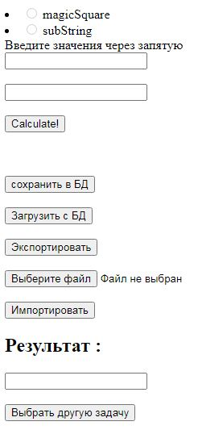

# MVC проект Магический квадрат
***
Есть две задачи (Магический квадрат и задача на содержание части строки их одного массива в другом),
они реализованы отдельными классами и написан пользовательский интерфейс(WEB GUI) к ним.
***
GUI:
* Поле ввода условий,
* Поле вывода результата,
* Combobox с выбором задачи,
* Кнопки: посчитать, сохранить, экспортировать, загрузить, импортировать.
***
* При нажатии на «сохранить»: сохраняет в БД данные из поля ввода и тип задачи.
* При нажатии на «экспортировать»: сохраняет в текстовый файл данные из поля ввода и тип задачи.
* При нажатии на «загрузить»: вызывает диалоговое окно с выбором данных из БД (например, по дате, по типу задачи, но на ваше усмотрение) и при выборе загружает данные и считает.
* При нажатии на «импортировать»: вызывает диалоговое окно с выбором файла и при выборе, загружает данные и считает.
***
В качестве СУБД используется H2. 
В качестве фреймворка: Spring + ThymeLeaf.
***

***
### МОЙ САЙТ
[Сайт](https://vilsurmurtazin.wixsite.com/index)
